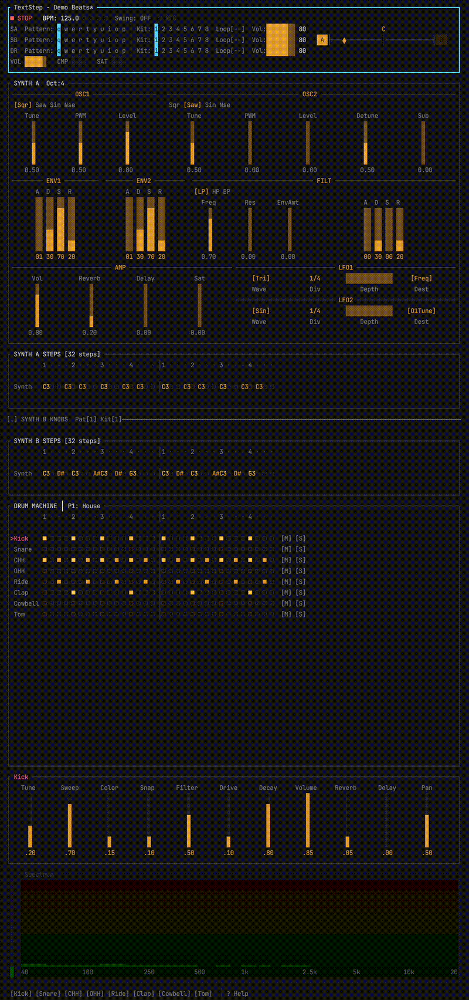

```
T E X T S T E P


A terminal-based step sequencer, drum machine, and synthesizer built in Rust.
All DSP from scratch — no samples, no external audio libraries. Just your terminal and your speakers.



## What Is This

TextStep is a TUI music production tool with:

- **8 drum tracks** — Kick, Snare, Closed HiHat, Open HiHat, Ride, Clap, Cowbell, Tom — each fully synthesized with 8 tweakable sound parameters
- **Polyphonic synth** — 2 oscillators + sub, 2 ADSR envelopes, resonant filter, LFO with 6 waveforms, collapsible UI section
- **32-step sequencer** with 10 patterns and 8 kit slots
- **Send effects chain** — Schroeder reverb, tempo-synced filtered delay, tube saturator, SSL-style glue compressor
- **Live performance** — drum pads, real-time recording, pattern queuing, per-pattern BPM
- **Mouse support** — click the grid, drag parameters Ableton-style, audition sounds from the activity bar
- **Project system** — save/load `.tsp` files, standalone kit export, preset browser

Ships with **10 demo patterns** ready to play: House, Chicago House, Brit House, French House, Dirty House, Trance, Techno, Drum & Bass, Trap, and Moombahton.

### Color Palette

Hardware/synthwave aesthetic — amber for data, cyan for transport, pink for focus, gold for queued state. All rendered with UTF-8 block characters on a dark background.

## Build & Run

Requires Rust (1.70+). macOS with CoreAudio is the primary target.

```bash
cargo build --release
cargo run --release
```

Run the tests:

```bash
cargo test
```

## Quick Manual

### Transport

| Key | Action |
|-----|--------|
| `Space` | Play / Pause |
| `Esc` | Stop (reset to step 0) |
| `-` / `=` | BPM -1 / +1 |
| `_` / `+` | BPM -10 / +10 |
| `` ` `` | Toggle record mode |
| `l` | Toggle loop on/off |
| `L` | Cycle loop length: 8 / 16 / 24 / 32 |
| `Shift+C` | Cycle compressor: Off / Light / Medium / Heavy / Max |

### Navigation

| Key | Action |
|-----|--------|
| `Tab` / `Shift+Tab` | Cycle focus: Grid → Controls → Transport |
| Arrow keys | Move cursor in grid or controls |
| `Enter` | Toggle step (and advance — hold to fill) |
| `;` | Cycle parameter page: SYN → AMP → FX |
| `F2` | Collapse/expand synth section |
| `~` | Toggle spectrum analyzer / VU meter |
| `?` | Help overlay |

### Sound Design

Each drum track has 8 parameters across three pages:

| Page | Parameters | Controls |
|------|------------|----------|
| **SYN** | Tune, Sweep, Color, Snap | Pitch, timbre, transient character |
| **AMP** | Filter, Drive, Decay, Volume | Tone shaping, saturation, envelope |
| **FX** | Reverb Send, Delay Send | Per-track effect routing |

Tweak with `Shift+Up/Down` (adjust value) or `Alt+Up/Down` (adjust and audition simultaneously). With the mouse, click-drag any gauge vertically. `Alt+R` randomizes the current page across all tracks.

Mute (`Shift+M`) and Solo (`Shift+S`) are always accessible on any page.

### Drum Pads

The bottom keyboard row triggers sounds live:

| `z` | `x` | `c` | `v` | `b` | `n` | `m` | `,` |
|-----|-----|-----|-----|-----|-----|-----|-----|
| Kick | Snare | CHH | OHH | Ride | Clap | Cowbell | Tom |

With record enabled and playback running, pad hits write steps at the playhead.

### Patterns & Kits

**Patterns** — 10 slots, each with its own step data and BPM:

| Key | Action |
|-----|--------|
| `q` `w` `e` `r` `t` `y` `u` `i` `o` `p` | Queue pattern 1–10 (switches at loop end) |
| `Shift+` above | Switch pattern immediately |
| `[` / `]` | Queue prev / next |
| `{` / `}` | Immediate prev / next |

**Kits** — 8 slots of sound parameters, shared across patterns:

| Key | Action |
|-----|--------|
| `1` through `8` | Switch to kit slot |

### Synth

The synth section (toggle visibility with `F2`) provides a polyphonic synthesizer with 2 main oscillators, a sub-oscillator, noise generator, two ADSR envelopes, a 24dB resonant filter, and an LFO with 6 waveforms. Synth notes are triggered with `z` `x` `c` `v` when the synth grid is focused, with `Up/Down` for pitch and `(` `)` for octave shifts.

### File Operations

| Key | Action |
|-----|--------|
| `Ctrl+S` | Save project |
| `Ctrl+O` | Load project |
| `Ctrl+N` | Rename current pattern |
| `Ctrl+K` | Save kit as standalone `.tsk` file |
| `Ctrl+J` | Load kit into active slot |
| `Ctrl+P` | Preset browser |
| `Ctrl+L` | Pattern browser |
| `Ctrl+C` / `Ctrl+Q` | Quit |

Projects are stored as JSON in `~/Library/Application Support/textstep/projects/`.

## Architecture

Two-thread model:

- **UI thread** — ratatui + crossterm for rendering and input at ~60fps
- **Audio thread** — cpal/CoreAudio callback running all DSP per-sample

Communication is lock-free via bounded crossbeam channels. The audio thread never blocks.

### DSP — All From Scratch

Every sound is synthesized in real-time with no external DSP dependencies:

- **Drum voices**: TR-808/909-inspired kicks (sine + pitch envelope + resonant impulse), noise-blended snares, 6-oscillator metallic banks for hats and rides (using Mutable Instruments Plaits-style inharmonic ratios), ring-modulated open hats, bandpass claps, detuned pulse cowbells, FM toms
- **Synth voice**: dual oscillators, sub, noise, two ADSR envelopes, resonant SVF filter, 6-waveform LFO
- **Effects**: Schroeder/Freeverb reverb (4 comb + 2 allpass), tempo-synced filtered delay, asymmetric tube saturator, feedforward RMS glue compressor with soft knee
- **Primitives**: 1-pole HP/LP filters, state-variable filter, xorshift32 noise, tanh waveshaping

### Dependencies

```
ratatui 0.29          TUI rendering
crossterm 0.28        Terminal backend
cpal 0.15             Audio I/O (CoreAudio)
crossbeam-channel 0.5 Lock-free channels
serde + serde_json    Project serialization
```

No other runtime dependencies.

See [BLUEPRINT.md](BLUEPRINT.md) for full technical documentation.

## License

[GNU General Public License v2.0](LICENSE)
